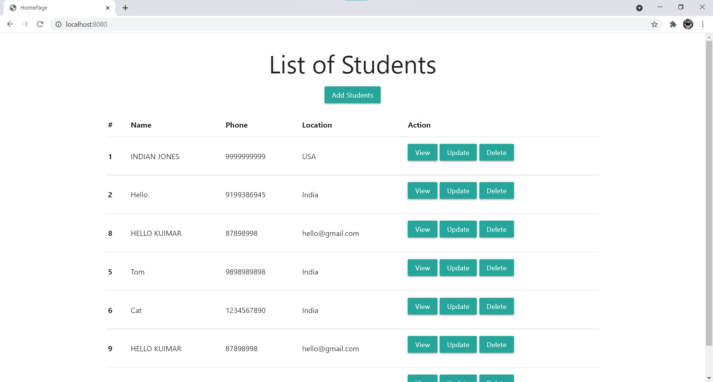
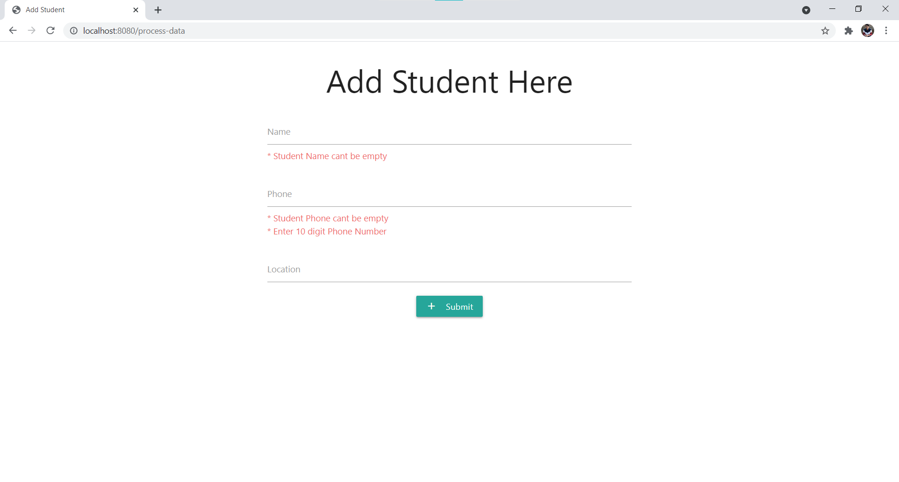

# Simple CRUD Web App on Spring MVC
First Spring project made a simple structure to understand working of Spring MVC.

**Database**
MySQL Database
- Table Name: Students (id,name,phone,location)
	      Course	(id,course,batch,college,tskills) (will add this soon)

**Extras**
- Spring MVC
- Database Connection
- Spring Validator
- Exception handling

**What's Inside**
- Simple CRUD based web app
- Simple student list from database
- Addition of student data
- Deletion of student data
- Updation os student data

#

