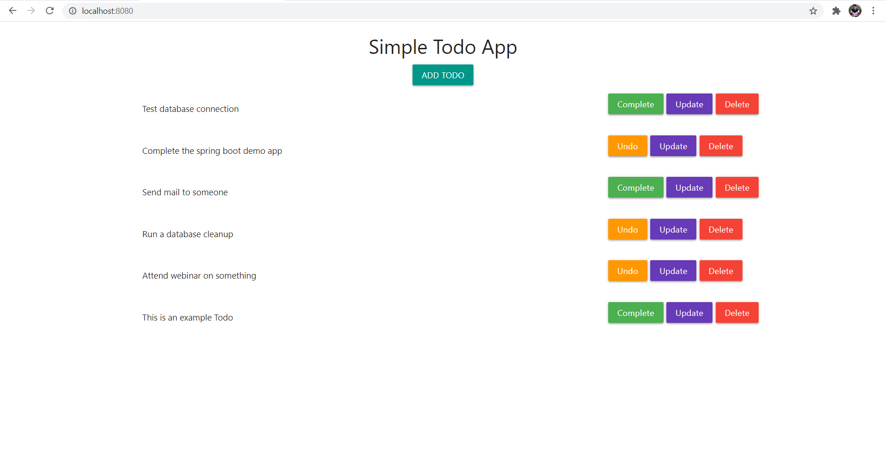

# Spring Boot App
A simple web app build using spring boot to understand working of spring boot.
Also to understand working of thymeleaf template and spring-boot-starter-data-jpa.

**Database**
MySQL Database
- Table Name: Todolist

**Extras**
- Spring Boot
- Database Connection (spring-boot-starter-data-jpa)
- Thymeleaf

**What's Inside**
- Simple CRUD based web app
- Add Todo to list
- Update Todo
- Mark a todo complete
- Delete Todo
#
