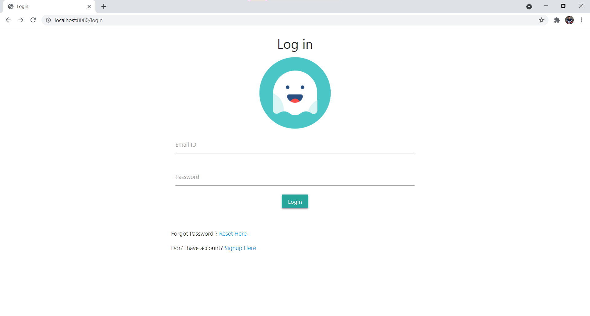
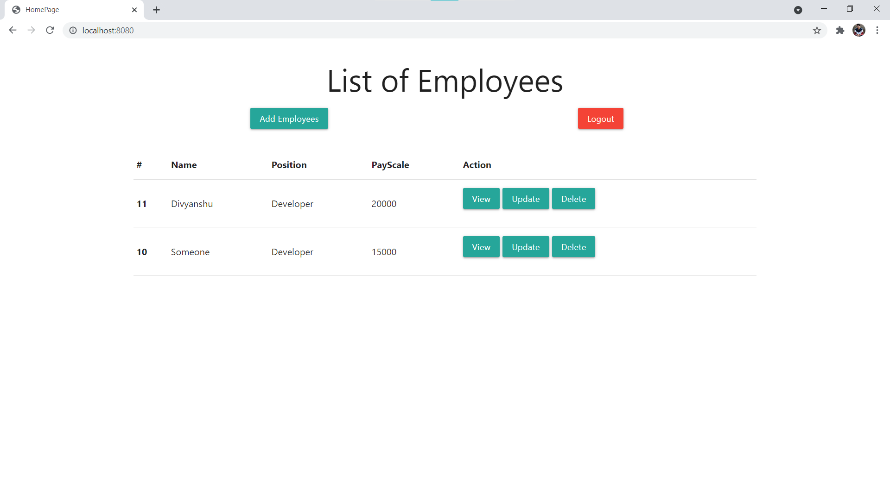
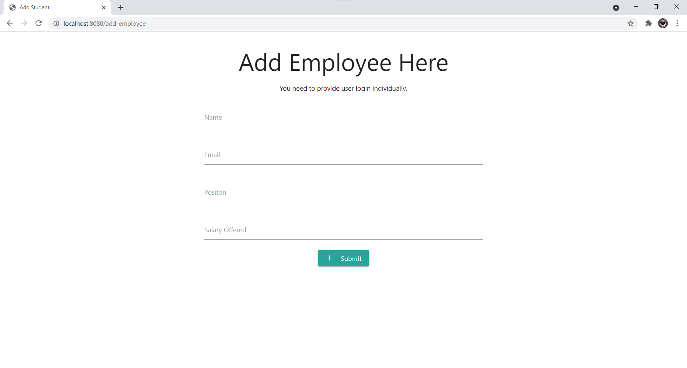
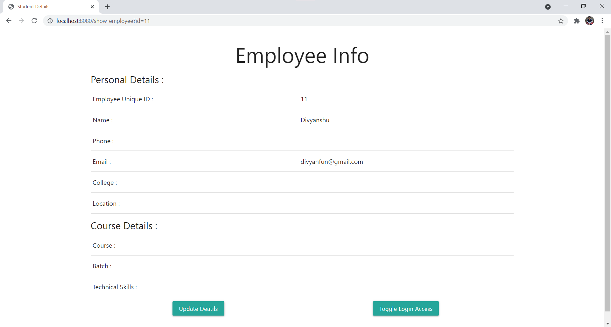
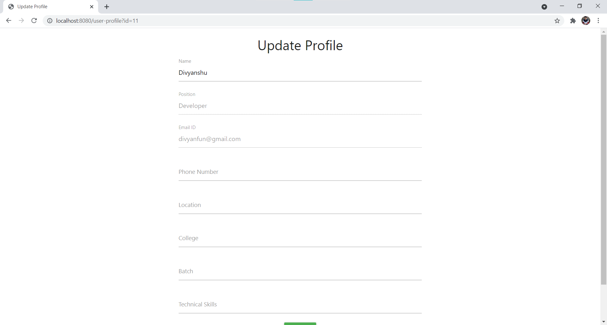
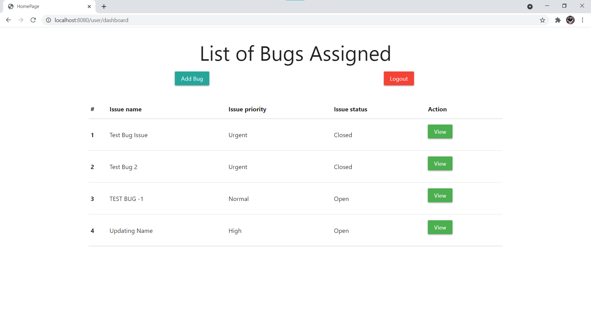
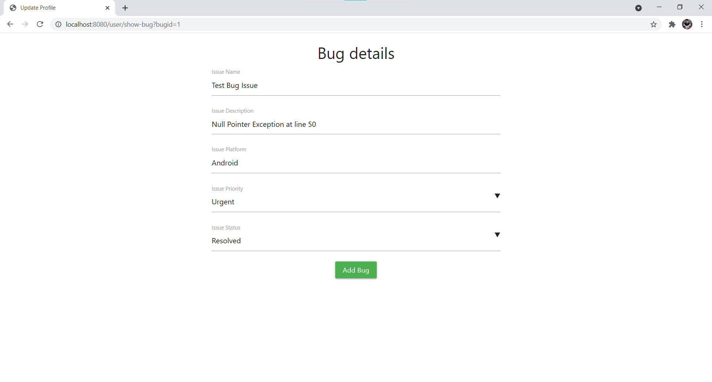

# Simple Web App on Spring MVC with Spring Security (Ongoing)
Project made a simple structure to understand working of Spring Security.
For understanding about spring security and how to secure routes also about roles and authorities in spring security.

**Database**
MySQL Database
- Table Name: Employee, Bugs

**Extras**
- Spring MVC with Spring Security
- Database Connection
- Exception handling

**What's Inside**
- Simple CRUD based web app
- Securing routes to web app
- Particular login for admin and user
- Custom login page for with authentication
- Addition of employee data
- Deletion of employee data
- Updation os employee data
#
    

      
      
    

    

      
      
    

    

      
      
    

    

      
    
